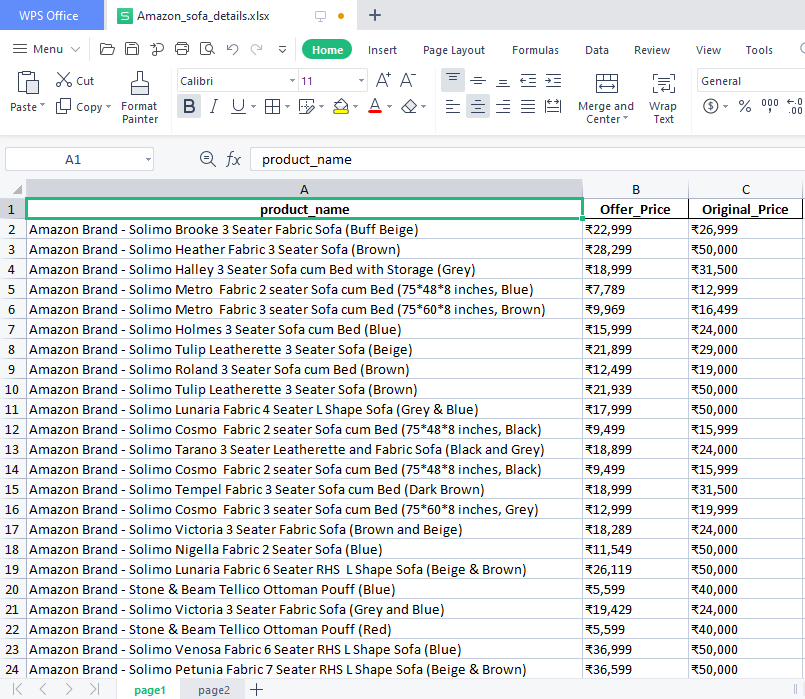

# Python_selenium  
-Here i extracted the Product_details,Offer_Price and Original_Price from the Amazon website into a Excelsheet     
-this will extract the data until the last page of the product items in the websites  
-I have choosen the offers in sofa and recliners details,its totally contains 2-pages in the website 

